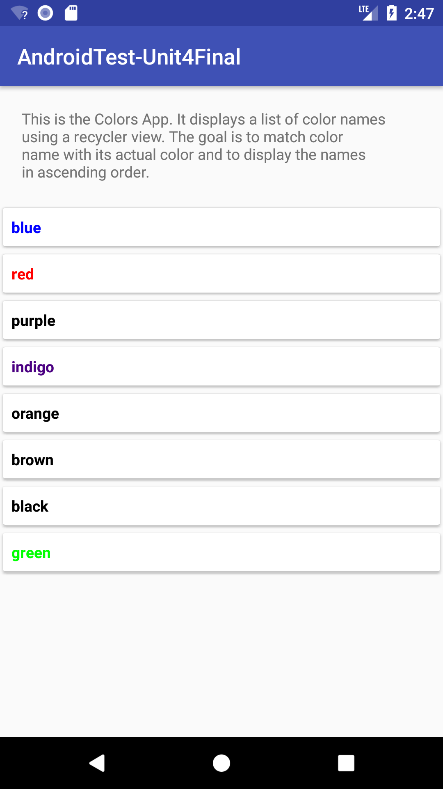

# Android App Unit 4 Final Test

## To get started,

1. *Fork* this repository first.
2. Then clone *your fork* of this repository

```
git clone https://github.com/YOUR_USERNAME/AC-AndroidTest-U4Final.git
```
3. To verify that you're in the right repository.
```
cd AC-AndroidTest-U4Final
git remote -v
output> origin  https://github.com/YOUR_USERNAME/AC-AndroidTest-U4Final.git (fetch)
output> origin  https://github.com/YOUR_USERNAME/AC-AndroidTest-U4Final.git (push)
```
4. Submit your repo link to Canvas (before continuing with the test)

**Do not *clone* this repository, *fork* it**

# The App

The test app displays color names, colored in their color names.

The initial app should look like:


The final app should look like:


### The differences
- All the color names are displayed with their respective colors in the final app
- The color names are sorted alphabetically
- There is a "More" button in the info section
- There is a "Info" menu item

## The Test

The test is a list of TODOs (tasks) that will take you from initial to final app.

There is **no order or precedence** to the instructions. So you can start from the last one if you wish.

You may use multiple branches if you wish, but only code in the **master** branch is graded. So if you must use branching, don't forget to merge.

You can find the tasks/TODOs in Android Studio by clicking on "Views > Tool Windows > TODO"

Please **do not** commit code that does not compile and run. Comment out the parts that are not working and make your commit.

There are also listed below:

* In Sort.java:
    ```
    Implement selection sort.
    ```

* In info_fragment.xml:
    ```
    1. Add a "More" button to this fragment. When the button is clicked,
    display the more_textView commented out below and hide the button
    2. Update the layout orientation to ensure text views and button are all visible.
    ```
* In ColorAdapter.java:
    ```
    When the name in a viewHolder is clicked,
    display a long toast with the text "{color_name} has a HEX value of {color_hex}
    for example: "blue has a HEX value of #0000ff".
    ```

* In MainActivity.java:
    ```
    Adding all the colors and their values would be tedious, instead fetch it from the url below
    https://raw.githubusercontent.com/operable/cog/master/priv/css-color-names.json.
    ```

    ```
    Add options menu with the item "Info" which is always visible
    When "Info" menu item is clicked, display the fragment InfoFragment
    If InfoFragment is already visible and I click "Info", remove InfoFragment from the view.
    ```

## Testing your solution

For Java (sorting):
* Open Android studio terminal (View > Tool Windows > Terminal) then paste and run `./gradlew test`.
* To view sorting test results, open in the file in AndroidTestUnit4Final/app/build/reports/tests/testDebugUnitTest/index.html.
* There should be some passing tests and some failing tests. If not, see an instructor or TA before continuing.

For Android (everything else):
* Open Android studio terminal (View > Tool Windows > Terminal) then paste and run `./gradlew connectedAndroidTest`.
* To view android test results, open in the file in AndroidTestUnit4Final/app/build/reports/androidTests/connected/index.html
* There should be some passing tests and some failing tests. If not, see an instructor or TA before continuing.


**Do not submit code that does not compile**

**Again, The TODOs are totally independent (but not equally weighted)... start from the ones you know**

## Git Tips

* Whenever you have an app that works, create a commit for it.
   ```
   git add .
   git commit -m "message here"
   ```
* To reset master to a working commit
   ```
   // from master branch run:
   git checkout -b aheadMaster  // to save current master tree to new branch
   git checkout master
   git reset --hard <commit-hash>
   ```
